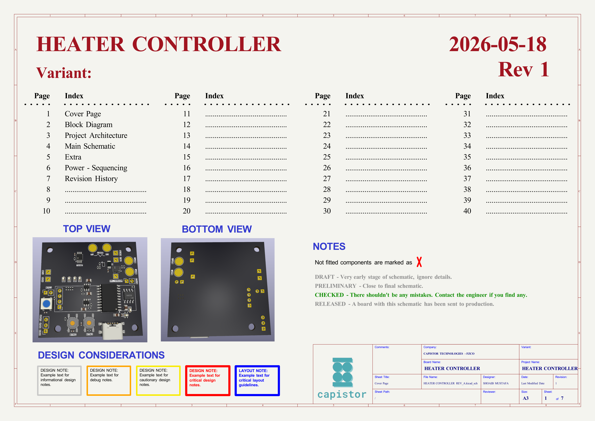
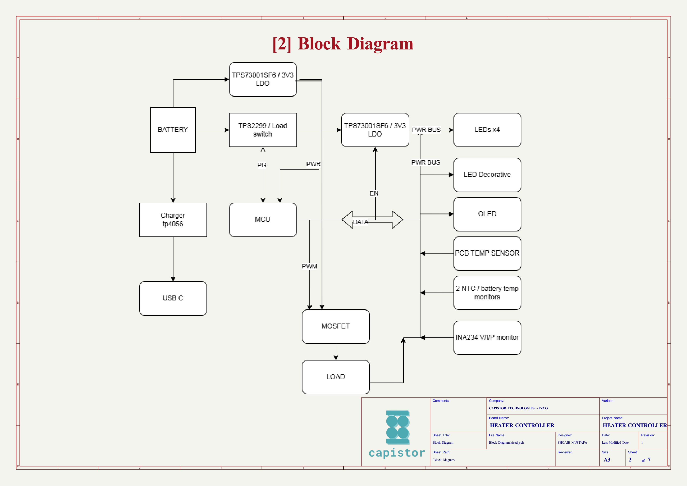
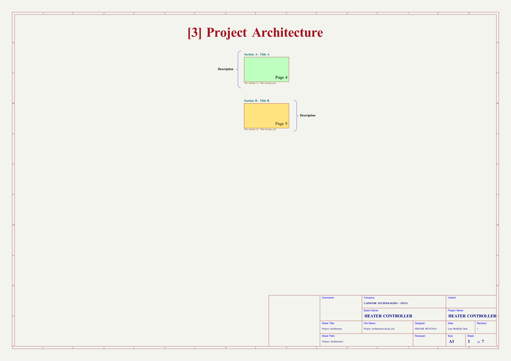
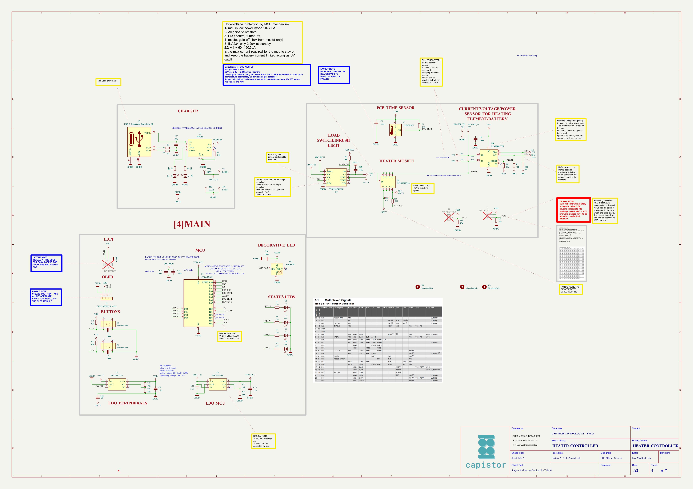
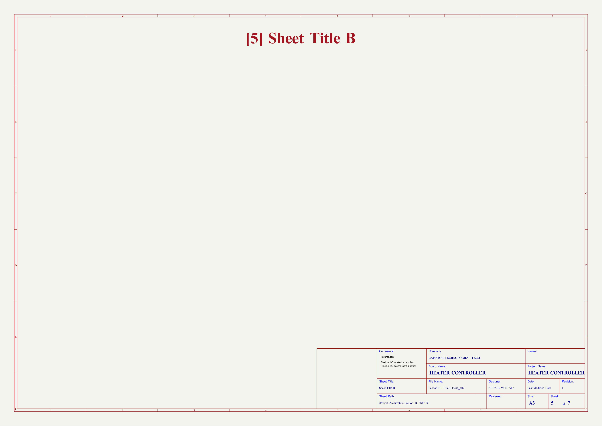
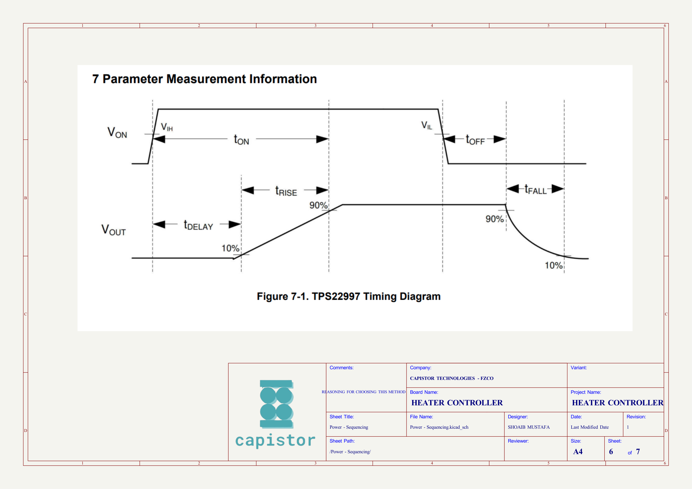
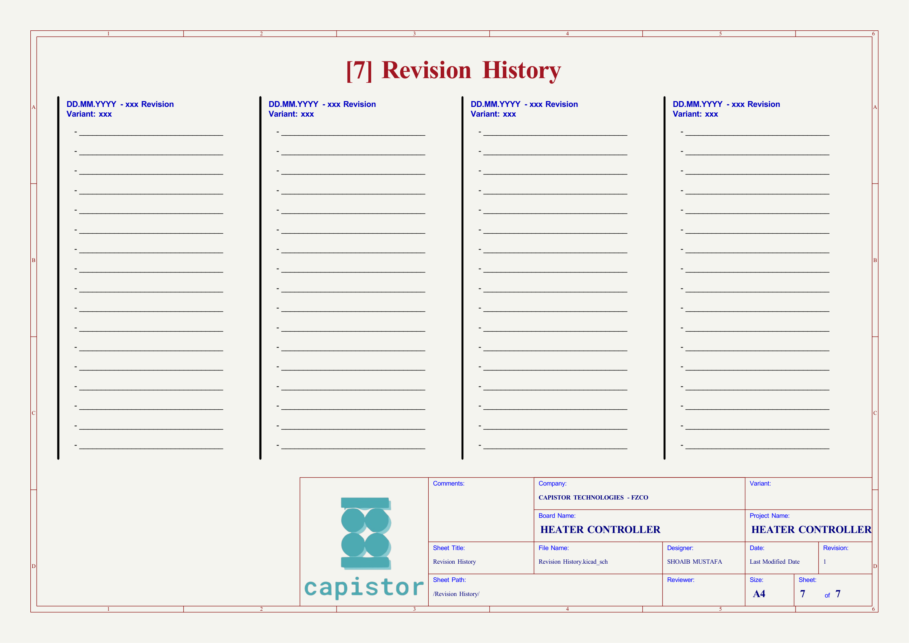
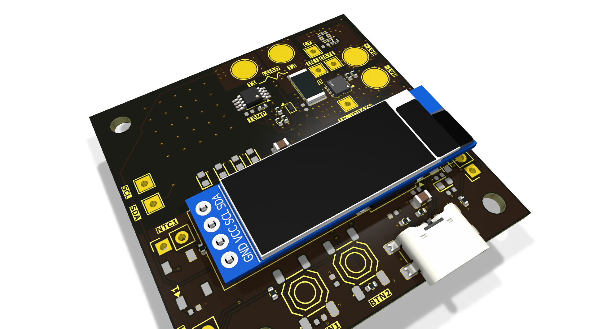
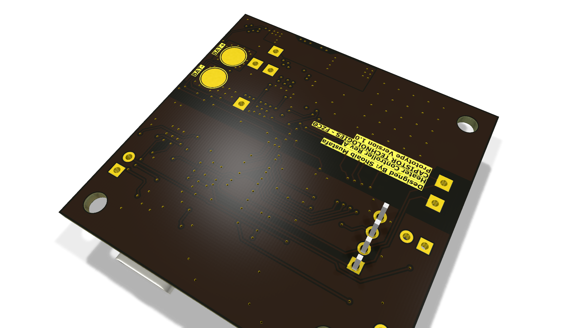
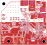

# HEATER CONTROLLER REV_A

Battery-powered heater controller, 10 A switching, hierarchical schematic (ATtiny + OLED + dual-battery taps)

## At a Glance

- **Status**: Routed
- **Board size**: 47.24 x 45.82 mm
- **Layers**: 2
- **Components**: 75
- **Key ICs**:
  - U1: ATtiny3216-S
  - U2: DS18B20U
  - U3: TP4056
  - U4: INA234AxYBJ
  - U5,U6: TPS73001SF6
  - U7: TPS22997RYZR

## Schematic

Full PDF: [reports/schematic.pdf](reports/schematic.pdf)

## Component Roles

- **ATtiny** (in hierarchical sub-sheets) - main MCU; reads temperature and PWM-drives the heater MOSFET
- **CSD17578Q3A** (Q2) - 30 V, 100 A, 1.8 m-Ohm N-channel MOSFET; switches the heater load directly (low Rds(on) keeps conduction losses small at 10 A)
- **WS2812B** (D5) - status RGB LED
- **USB-C** charging input (power-only, 6P)
- **Dual battery taps** (TP1-TP4: BAT1+, BAT1-, BAT2+, BAT2-) for parallel/series battery configurations
- **Heater output taps** (TP5/TP6: HEATER_T1, HEATER_T2)
- Hierarchical schematic split across: Block Diagram, Project Architecture, Power-Sequencing, and Section A/B sub-sheets

## PCB

**Top copper**

**Bottom copper**

## Bill of Materials

| Refs | Value | Footprint | Qty | MPN | LCSC |
|------|-------|-----------|----:|-----|------|
| C1,C3-C7,C10,C12 | 100n | PCM_JLCPCB:C_0402 | 8 |  |  |
| C2 | 100u | Capacitor_SMD:C_0805_2012Metric | 1 |  | [C141660](https://www.lcsc.com/product-detail/_C141660.html) |
| C8,C9,C11,C13 | 2.2u | Capacitor_SMD:C_0805_2012Metric | 4 |  |  |
| D1,D6,D7 | Red | PCM_JLCPCB:D_0603 | 3 |  | [C2286](https://www.lcsc.com/product-detail/_C2286.html) |
| D2 | White | PCM_JLCPCB:D_0603 | 1 |  | [C2290](https://www.lcsc.com/product-detail/_C2290.html) |
| D3 | Yellow | PCM_JLCPCB:D_0603 | 1 |  | [C89811](https://www.lcsc.com/product-detail/_C89811.html) |
| D4 | Green | PCM_JLCPCB:D_0603 | 1 |  | [C122984](https://www.lcsc.com/product-detail/_C122984.html) |
| D5 | WS2812B | PCM_JLCPCB:LED_WS2812B_PLCC4_5.0x5.0mm_P3.2mm | 1 |  | [C22461793](https://www.lcsc.com/product-detail/_C22461793.html) |
| J5 | USB_C_Receptacle_PowerOnly_6P | Connector_USB:USB_C_Receptacle_GCT_USB4135-GF-A_6P_TopMnt_Horizontal | 1 |  |  |
| Q2 | CSD17578Q3A | mosfet_ti:PDFN3333-8_L3.1-W3.2-P0.65-LS3.4-BL | 1 |  |  |
| R1 | 4.7k | Resistor_SMD:R_0402_1005Metric | 1 |  |  |
| R2 | 1.2k | Resistor_SMD:R_0402_1005Metric | 1 |  |  |
| R3,R4 | 5.1k | Resistor_SMD:R_0402_1005Metric | 2 |  |  |
| R5,R6,R11,R12,R14,R15,R18,R19,R21,R24,R25 | 10k | Resistor_SMD:R_0402_1005Metric | 11 |  |  |
| R7-R10 | 330 | PCM_JLCPCB:R_0402 | 4 |  |  |
| R13 | 8m | Resistor_SMD:R_2512_6332Metric | 1 |  | [C2904240](https://www.lcsc.com/product-detail/_C2904240.html) |
| R16,R17 | 1k | PCM_JLCPCB:R_0402 | 2 |  |  |
| R20,R26 | 46k | Resistor_SMD:R_0402_1005Metric | 2 |  | [C3016791](https://www.lcsc.com/product-detail/_C3016791.html) |
| R23 | 330 | Resistor_SMD:R_0402_1005Metric | 1 |  |  |
| S1,S3 | Tactile Button, 160gf | PCM_JLCPCB:SW-SMD_4P-L5.1-W5.1-P3.70-LS6.5-TL-2 | 2 |  | [C318884](https://www.lcsc.com/product-detail/_C318884.html) |
| TP1 | BAT2+ | TestPoint:TestPoint_Pad_D4.0mm | 1 |  |  |
| TP2 | BAT2- | TestPoint:TestPoint_Pad_D4.0mm | 1 |  |  |
| TP3 | BAT1+ | TestPoint:TestPoint_Pad_D4.0mm | 1 |  |  |
| TP4 | BAT1- | TestPoint:TestPoint_Pad_D4.0mm | 1 |  |  |
| TP5 | HEATER_T2 | TestPoint:TestPoint_Pad_D4.0mm | 1 |  |  |
| TP6 | HEATER_T1 | TestPoint:TestPoint_Pad_D4.0mm | 1 |  |  |
| TP7,TP9,TP10 | IN+ | TestPoint:TestPoint_THTPad_2.0x2.0mm_Drill1.0mm | 3 |  |  |
| TP8 | IN- | TestPoint:TestPoint_THTPad_2.0x2.0mm_Drill1.0mm | 1 |  |  |
| TP11 | CT | TestPoint:TestPoint_THTPad_2.0x2.0mm_Drill1.0mm | 1 |  |  |
| TP12 | GATE | TestPoint:TestPoint_THTPad_2.0x2.0mm_Drill1.0mm | 1 |  |  |
| U1 | ATtiny3216-S | Package_SO:SOIC-20W_7.5x12.8mm_P1.27mm | 1 |  |  |
| U2 | DS18B20U | Package_SO:MSOP-8_3x3mm_P0.65mm | 1 |  |  |
| U3 | TP4056 | PCM_JLCPCB:ESOP-8_L4.9-W3.9-P1.27-LS6.0-BL-EP | 1 |  | [C16581](https://www.lcsc.com/product-detail/_C16581.html) |
| U4 | INA234AxYBJ | Package_BGA:Texas_DSBGA-8_0.705x1.468mm_Layout2x4_P0.4mm | 1 |  |  |
| U5,U6 | TPS73001SF6 | tps73001sf6:SOT-23-6_L2.9-W1.6-P0.95-LS2.8-BL | 2 |  |  |
| U7 | TPS22997RYZR | load_switch:UQFN-10_L2.0-W1.5-P0.50-TL | 1 |  |  |

_26 of 36 line items don't have an LCSC code in the schematic - search [LCSC](https://www.lcsc.com/) or [JLC parts search](https://jlcsearch.tscircuit.com/) by MPN or footprint when sourcing._

## Files

- `HEATER CONTROLLER REV_A.kicad_pro` - KiCad project
- `HEATER CONTROLLER REV_A.kicad_sch` - schematic source
- `HEATER CONTROLLER REV_A.kicad_pcb` - PCB layout source
- `reports/schematic.pdf` - full schematic (printable)
- `reports/bom.csv` - bill of materials
- `reports/pcb-top.svg`, `reports/pcb-bottom.svg` - copper artwork
- `reports/board-stats.json` - KiCad-generated board statistics

---

_Renders and metadata auto-generated by `Backup-KiCadProject.ps1` using KiCad 10.0._

